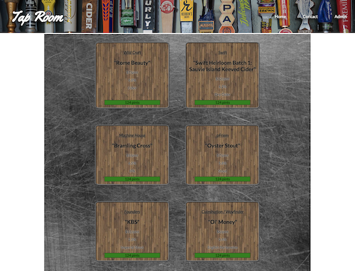
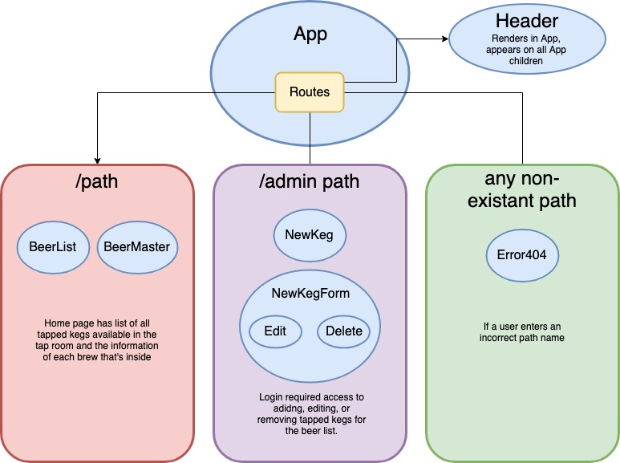

# Tap Room - React Build

#### _Front End Development/React Week 1 and 2, Independent Project - Week 15 and 16, 4.19.19-4.26.19_

#### By _**Randee Layosa**_


[](https://opensource.org/licenses/MIT)

## Description

_This application is a repurpose of an in-class project previously written in Angular, now using the React library._

## Preview
<p align="center">

</p>

## Technologies Used

  * _React_
  * _Webpack_
  * _eslint_
  * _Sass_
  * _JSX_

## Setup/Installation Requirements

#### To open and view this project file:
1. Or, clone this GitHub repository https://github.com/randeelayosa/tap-room-react.git to your Desktop.
  * Install git onto your computer if it isn't already.
  * To clone the project down to your desktop, open your Terminal, and enter the following commands:
  ```
  cd desktop
  git clone [paste link here]
  cd [project folder name]
  atom .
  npm install
  npm run start
  ```
  * _You can use another text editor if Atom is not your preferred program._
  * _Make sure a "node_modules" folder is created in your project file. If it hasn't, run `npm install` again._
  * _You can then go to the link in step 1 above, or continue on to the following instructions to run the server._
2. Go to http://localhost:8080/ in the browser of your choice. _Note: The app will automatically reload if you edit any of the code in the source files._


## Planning

  | **Configuration/Dependencies** | **Use** |
| :-------------     | :------------- |
| Babel | JS transpiler |
| CSS-Loader, Style-Loader, Sass-Loader, Node-Sass | styling |
| ESLint | JS linter, checks code for errors |
| File-Loader, URL-Loader | image loader |
| HTML-Webpack-Plugin | loads HTML file |
| Jasmine, Karma | for testing code |
| React | JS Library |
| Webpack | bundles/compiles code |

### Components and Routes Layout

<p align="center">
  
</p>

### Features Built and To Be Completed
- [x] Navigation bar
- [x] Component for list of beers
- [x] Component for admin to edit list of beers and information
- [ ] Authentication/Sign in feature to allow admin users
- [ ] Page routing
- [x] Sass styling

## Known Bugs
You will get an `Expected linebreaks to be 'LF' but found 'CRLF'` error if you are using a PC and run `npm run lint`. It does not break the code and will still run correctly when you run `npm run start`.

### Legal

*This software is licensed under MIT license.*

Copyright (c) 2019 **_Randee Layosa_**
